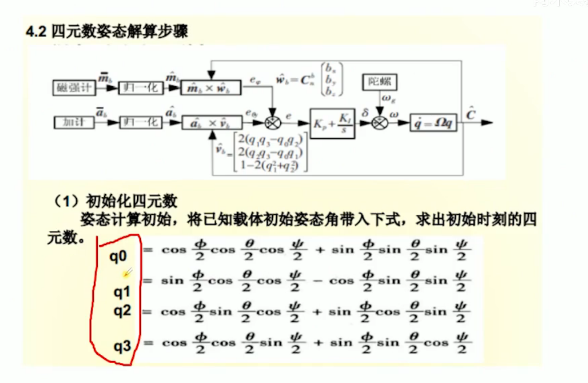
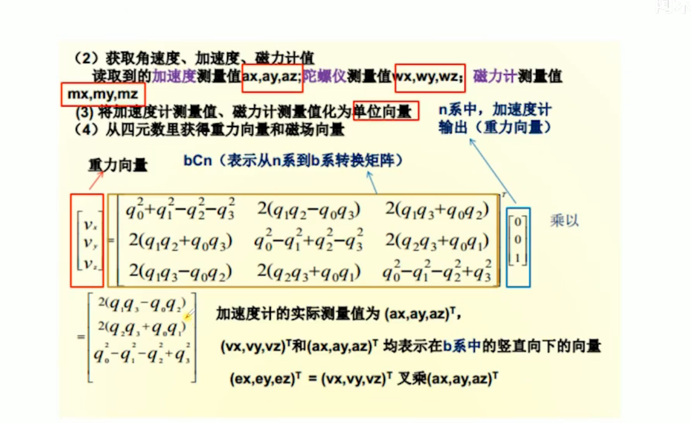
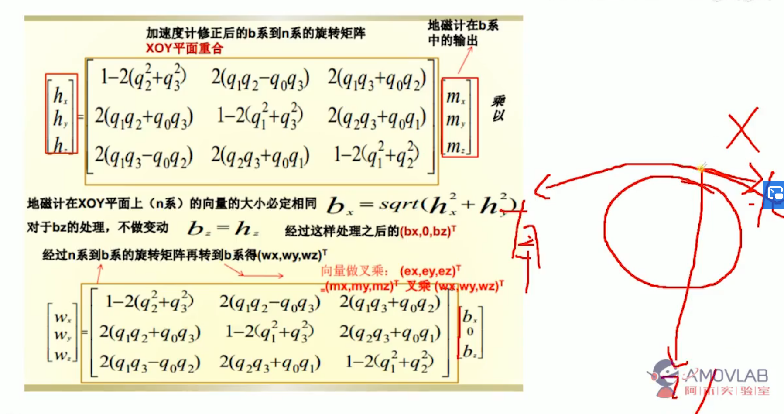
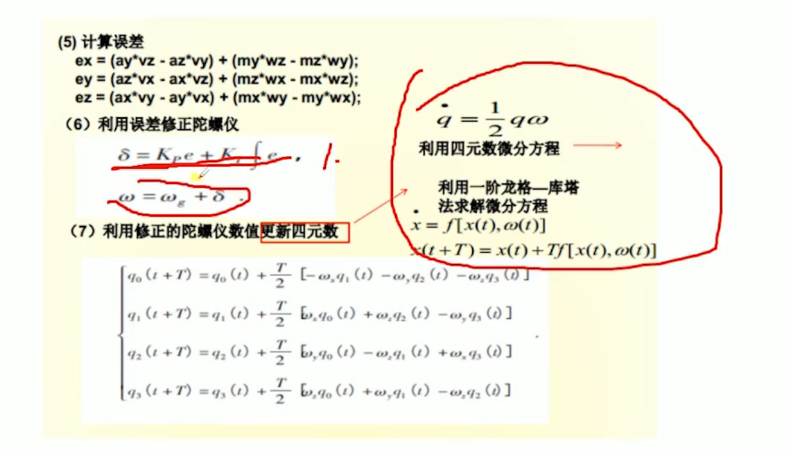
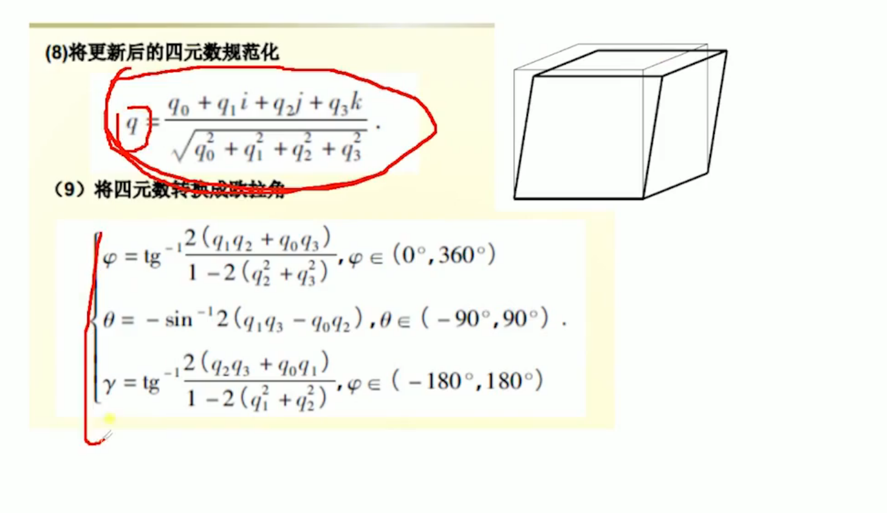
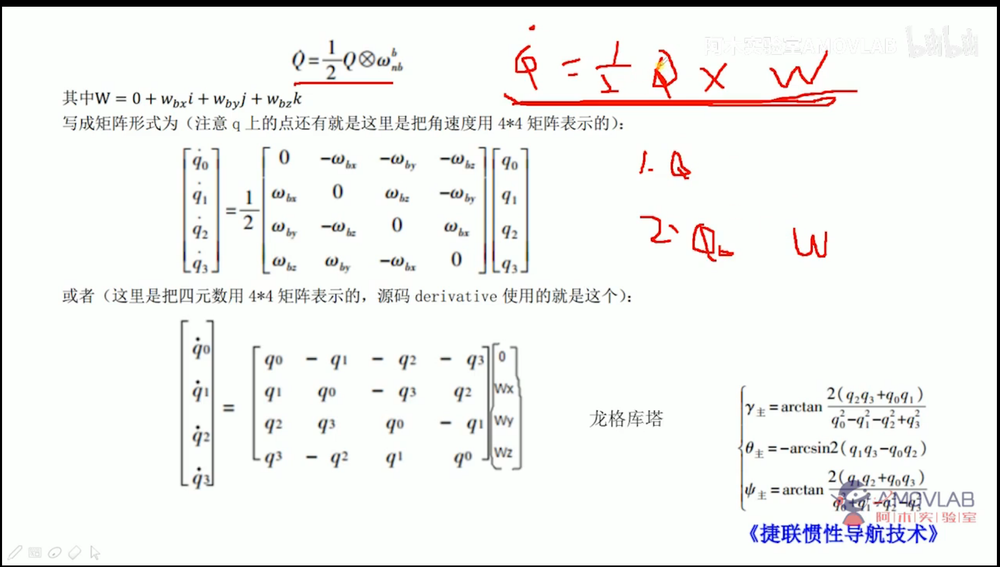

# 姿态估计原理

积分可以看作积分滤波器
龙哥库塔

*四元数结算*

*从四元数获得重力向量*

*加速度修正*

*计算误差*

*四元数微分方程*

# 姿态估计源码

~~~ c++
class AttitudeEstimatorQ :
public  ModuleBase<AttitudeEstimatorQ>,
public   ModuleParams,
public px4::WorkItem
~~~
其中ModuleBase在
platforms/common/include/px4_platform_common/modules.h
***
~~~c++
ret = T::task_spawn(argc, argv);
~~~
其中 task_spawn在start 中调用

